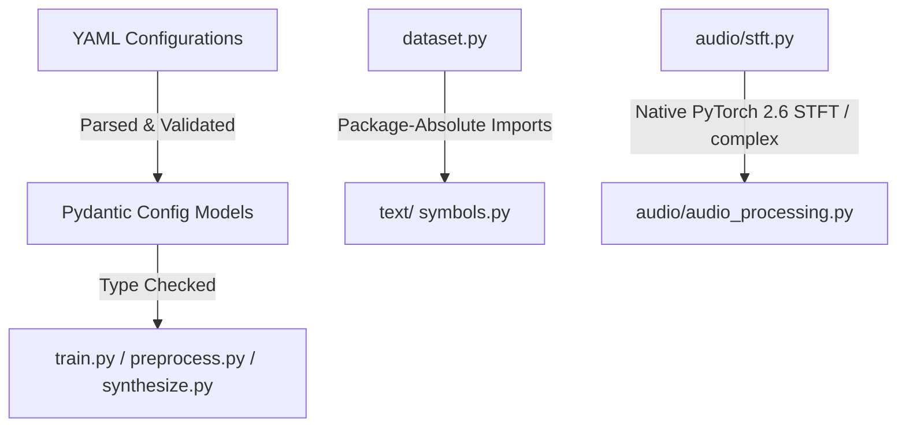

# Modernize DailyTalk Design

**Spec**: `.specs/features/modernization/spec.md`
**Status**: Draft

---

## Architecture Overview

The modernization strategy upgrades the core libraries (PyTorch 2.6+, TensorFlow 2.18+, NumPy 2.x+) and Python interpreter (3.14+) while ensuring correct and robust execution of the training, preprocessing, and inference scripts using `uv`.

To make the codebase type-safe, robust, and clean, we will implement:
1. **Pydantic Configuration Validation Layer**: Parse configurations using strictly typed `pydantic.BaseModel` rather than unstructured YAML dictionaries.
2. **Package-Absolute Import Migration**: Standardize all module imports using the parent namespace `dailytalk.` (e.g. `from dailytalk.text import cleaners` rather than `from text import cleaners`).
3. **STFT Refactoring**: Remove legacy constructs like `torch.autograd.Variable` in `audio/stft.py` and replace with modern native complex STFT or standard float operations.
4. **NumPy 2.x compatibility layer**: Replace legacy aliases (such as `np.float` and `np.int`) with built-in `float` and `int`.
5. **Robust Unit Tests**: Fully test each component within `tests/` using `pytest`.



---

## Code Reuse Analysis

### Existing Components to Leverage

| Component | Location | How to Use |
| --------- | -------- | ---------- |
| TacotronSTFT | `src/dailytalk/audio/stft.py` | Modernize to remove deprecated imports and types, reuse existing basis matrix math. |
| Text Cleaners | `src/dailytalk/text/` | Keep phoneme conversion pipelines, standardizing imports to package-absolute. |
| DeepSpeaker | `src/dailytalk/deepspeaker/` | Modernize Keras/TensorFlow imports to support Keras 3.x, keeping weight loader backward compatible. |

### Integration Points

| System | Integration Method |
| ------ | ------------------ |
| `get_configs_of` | In `utils/tools.py`, we will wrap and return Pydantic BaseModel instances when requested, or provide a `.dict()` / `.model_dump()` backward compatibility layer. |

---

## Components

### Configuration Models

- **Purpose**: Strictly validate and provide type-safe access to preprocess, model, and train configurations.
- **Location**: `src/dailytalk/config_models.py`
- **Interfaces**:
  - `PreprocessConfig`: Pydantic model for `preprocess.yaml`
  - `ModelConfig`: Pydantic model for `model.yaml`
  - `TrainConfig`: Pydantic model for `train.yaml`
  - `get_validated_configs(dataset: str) -> Tuple[PreprocessConfig, ModelConfig, TrainConfig]`
- **Dependencies**: `pydantic`, `pyyaml`
- **Reuses**: None, completely new component.

### STFT & Audio processing

- **Purpose**: Extract mel spectrograms and energy cleanly without deprecated structures.
- **Location**: `src/dailytalk/audio/stft.py`, `src/dailytalk/audio/audio_processing.py`
- **Interfaces**:
  - `STFT` module and `TacotronSTFT` module
- **Dependencies**: `torch`, `numpy`, `scipy`
- **Reuses**: Reuses existing filter computation but replaces deprecated `torch.autograd.Variable`.

---

## Data Models

All configuration schemas will be structured as Pydantic models. For example:

```python
from pydantic import BaseModel, Field
from typing import List, Optional, Union

class PathConfig(BaseModel):
    corpus_path: str
    sub_dir_name: str
    lexicon_path: str
    raw_path: str
    preprocessed_path: str

class AudioConfig(BaseModel):
    trim_top_db: int
    sampling_rate: int
    max_wav_value: float
```

---

## Error Handling Strategy

| Error Scenario | Handling | User Impact |
| -------------- | -------- | ----------- |
| Missing/Invalid Config Field | Pydantic raises `ValidationError` during startup | Clear error message pointing to the wrong/missing parameter, preventing training on faulty configs. |
| Deprecated NumPy type usage | Throws exception under NumPy 2.x | Mitigated entirely by global search & replace before execution. |
| Deprecated PyTorch Variable | Throws warning/error on modern torch | Removed entirely. |

---

## Risks & Concerns

| Concern | Location (file:line) | Impact | Mitigation |
| ------- | -------------------- | ------ | ---------- |
| Legacy `np.float` & `np.int` | Multiple files | NumPy 2.x crash on import/run | Global search-and-replace to built-in types `float` and `int`. |
| Deprecated `six` metadata loader | `utils/tools.py:1-18` | Ty check flags unresolved attributes | Change `six` meta path patch to use `getattr` or ignore via type comments. |
| Legacy Keras/TF backend imports | `deepspeaker/conv_models.py` | TensorFlow 2.18+ / Keras 3 crash | Update imports to modern standard `keras` or `tensorflow.keras` namespace. |

---

## Tech Decisions

| Decision | Choice | Rationale |
| -------- | ------ | --------- |
| Package-absolute imports | `from dailytalk.text import ...` | Standard Python layout that works perfectly with `ty` typechecker and package installers. |
| Pydantic BaseModel wrapping | Complete wrapping of YAMLs | Fulfills constraints while offering robust, runtime-validated type-safe access to configurations. |
